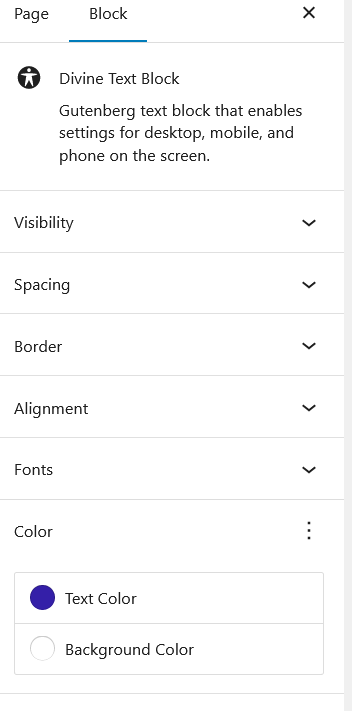

# Divine Blocks

Divine Text Block permits a user to change the block settings for tablet and mobile on the screen rather than relying on a
programmer to add these settings to a CSS file. The changes show on the edit screen.

Most Gutenberg blocks only allow the settings for the desktop to be changed. And even if they enables
changes to tablet and phone, these changes do not show on the edit screen.

## Installation

1. Upload the plugin files to the `/wp-content/plugins/divineblocks` directory, or install the plugin through the WordPress plugins screen directly.
2. Activate the plugin through the 'Plugins' screen in WordPress

## Usage

Insert the block via Blocks listing under "Divine Category"

Place your cursor on the block and view the selections on the right side menu

Click the down arrow on a selection on the right side menu to set the attributes for the desktop, tablet or mobile

